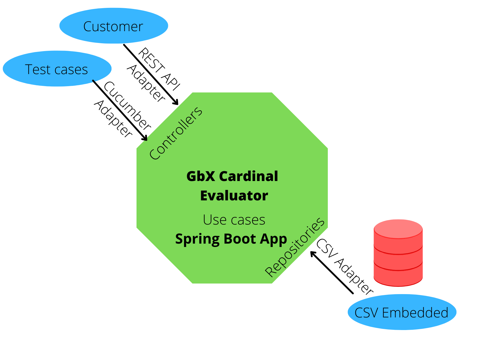

# GbX Cardinal Numbers Evaluator
This app expose REST API to evaluate the cardinals numbers embedded in a phrase and
transform this numbers in decimal base digits.
## Caution
The app only evalue Integers cardinals numbers 
## Demo
For live demo of application, please visit the next link
http://3.208.24.200:8080/swagger-ui/index.html
## Software requirements
- Java JDK 11
- Docker
## Architecture
This project use Clean Code Architecture with DDD patterns and BDD patterns. The architecture permits switch the adapters easily to external database or REST services as improvement.



## Technology
The application use the next tools and frameworks:
- Java 11
- Gradle 7
- Spring Boot 2
- Lombok
- Cucumber 7
- Junit 5
## Structure folders
### Main source folder
- "com.gbx.cardinalevaluator" as package base
- "application" subpackage for logic application
- "domain" subpackage to deliver information to client
- "infrastructure" subpackage to implements specific integrations to external tools
- "resources" package to locate config files to application
- "resources.dictionary" package to locate the dictionary Database in CSV format "CardinalNumbersDictionary_es.csv". Support only spanish dialect in this moment.
### Test source folder
- "com.gbx.cardinalevaluator" as package base
- "test" subpackage to implements Unit Test and Functional Test of application
- "resources" package to locate Gherkin features files to implement BDD testing
- Unit test scenarios coded in file "test/resources/features/CardinalNumbersUnit.feature" relative to project folder
- Functional/Integration test scenarios coded in file "test/resources/features/CardinalNumbersFuntional.feature" relative to project folder
## Installation instructions
1. Clone the repository
```
git clone https://github.com/barahonachrism/gbx-cardinal-evaluator.git
```
2. Go to repository folder and execute command line prompt.
4. Execute the next code in command line console to compile and run test:
```
./gradlew clean build
```
5. Optionally, execute only functional and unit test
```
./gradlew test
```
7. Optionally, execute the next code for run standalone application in console.
```
./gradlew bootRun
```
8. Execute the next code to generate Docker image
```
./gradlew bootBuildImage
```
9. Run application in container mode.
```
docker run --name gbx-cardinal-evaluator -d -p 8080:8080 barahonachrism/gbx-cardinal-evaluator:1.0-SNAPSHOT 
```
10. To view the test report, open the next file relative to this project folder
```
build/reports/tests/test/index.html
```
11. To view the coverage code report, open the next file relative to this project folder
```
build/reports/jacoco/test/html/index.html
```
12. To view the behavior test report, open the next file relative to this project folder
```
build/cucumber/report.html
```
13. To view the static code analysis, open the next link https://sonarcloud.io/summary/overall?id=barahonachrism_gbx-cardinal-evaluator

